<div align="center">
  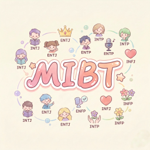
</div>

# PersonaPop (人格泡泡) 🎨

PersonaPop 是由 **React Native (Expo)** 和 **Supabase** 构建的手绘风格 MBTI 人格生成器。它允许用户根据他们的 MBTI 类型和当前心情生成独特的艺术人格卡片。

## ✨ 功能特性

### 核心功能
- **手绘美学**：模拟素描/漫画风格的自定义 UI 组件
- **MBTI 生成**：生成包含图片和文案的人格卡片
- **16种人格类型**：每种类型都有独特的角色图片和描述

## 📸 应用展示 (Application Showcase)

| | | |
| :---: | :---: | :---: |
| 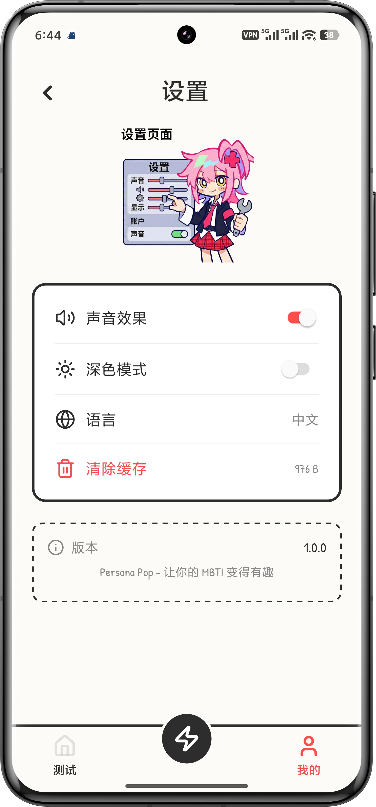 | 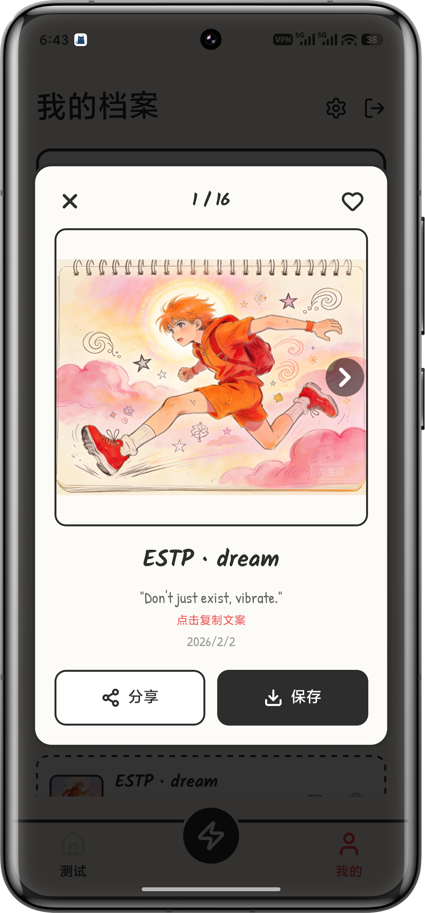 |  |
| 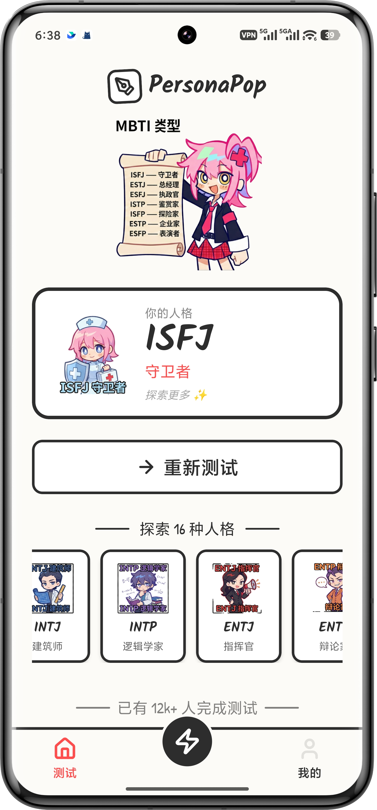 | 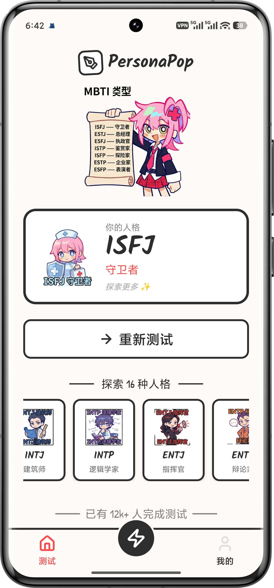 | 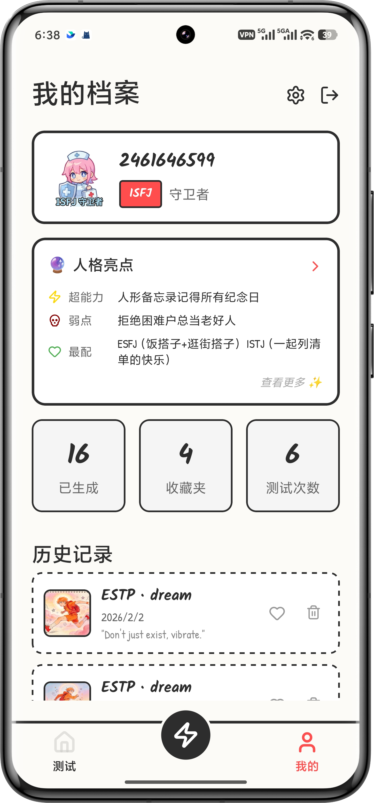 |
| 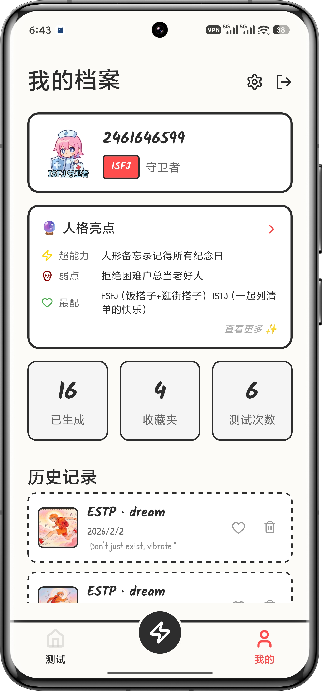 | 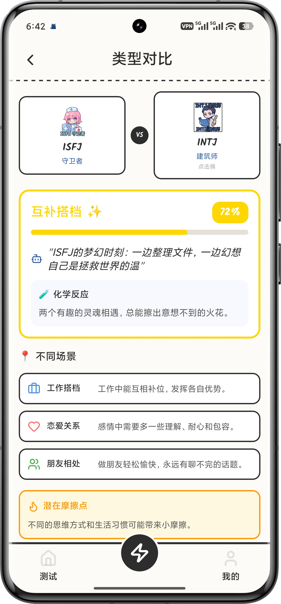 | 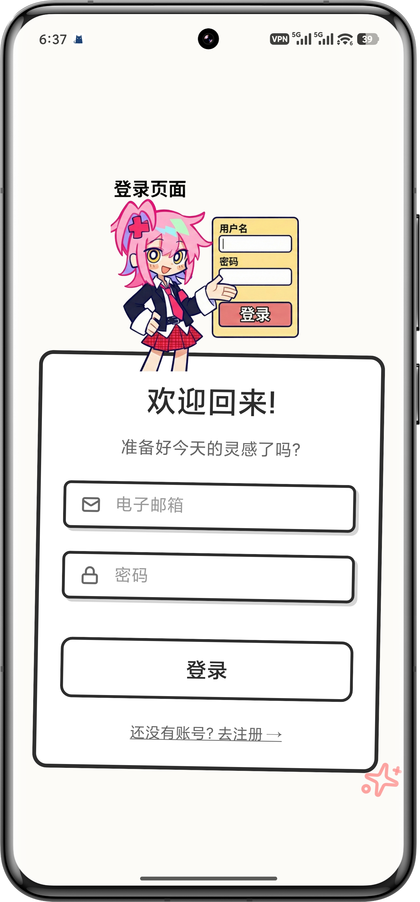 |
| 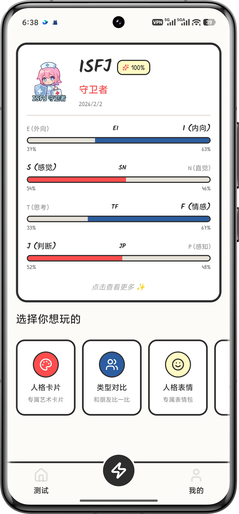 | 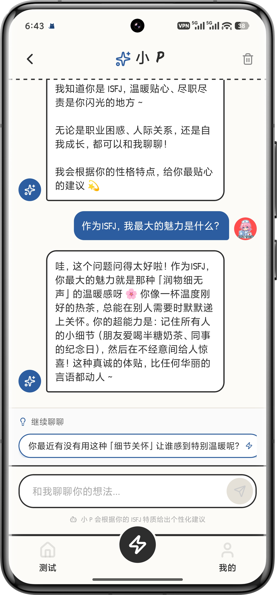 | 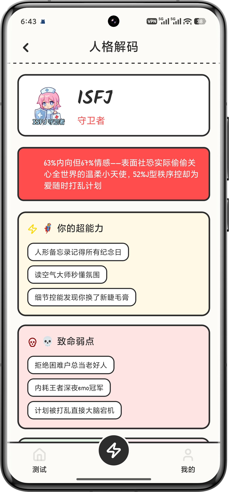 |
| 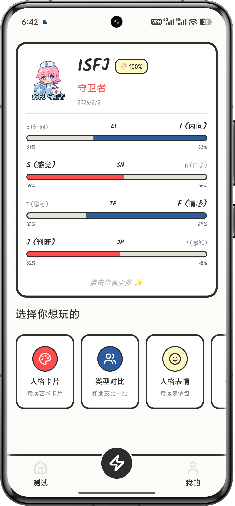 | | |

### MBTI 测试 🧪
- **12道测试题**：科学设计的问题覆盖四个维度 (E/I, S/N, T/F, J/P)
- **科学计算引擎**：
  - **质量检测**：自动识别直线作答、极端回答和随机模式
  - **置信度评估**：基于答题一致性和完成度计算结果可信度
  - **加权算法**：结合用户档案（职业/年龄）动态调整维度权重
- **智能推荐**：根据答案自动计算并推荐最匹配的 MBTI 类型
- **快速入口**：不确定自己类型？一键开始测试

### 🔮 全新互动模块
- **CP 匹配 (Match)**：分析两人性格契合度，提供相处建议
- **性格比对 (Compare)**：直观对比两种人格的思维差异
- **每日运势 (Fortune)**：基于性格的每日运势签和专属 Emoji
- **AI 助手 (Chat)**：24小时在线的 MBTI 专家，解答你的任何性格困惑

### AI 智能洞察 🤖
- **DeepSeek AI 集成**：生成深度个性化分析
- **多维报告**：
  - 🦸 **超能力**: 你的核心天赋
  - ⚠️ **致命弱点**: 需要注意的盲区
  - ❤️ **灵魂伴侣**: 谁最懂你
  - ⚡ **宿敌**: 谁让你抓狂
  - 📖 **使用说明书**: 如何正确对待你
- **实时洞察**：在加载过程中展示 AI 生成的趣味冷知识
- **趣事展示**：每种类型都有独特的趣事和名言

### 设置中心 ⚙️
- **声音开关**：控制应用音效
- **深色模式**：护眼暗色主题 (开发中)
- **语言切换**：支持中英文 (开发中)
- **清除缓存**：一键清理本地数据

### 数据存储
- **Supabase 集成**：
  - **身份验证**：真实的用户注册/登录
  - **数据库**：云端存储生成的人格卡片
- **个人档案**：查看生成的历史记录
- **收藏功能**：收藏喜欢的人格卡片

### 分享功能
- **一键分享**：分享到社交平台
- **保存相册**：保存卡片到手机相册

## 🛠️ 技术栈

- **框架**: React Native (Expo Router)
- **样式**: StyleSheet (自定义手绘设计系统)
- **图标**: Lucide React Native
- **后端**: Supabase (Auth + Postgres)
- **AI**: DeepSeek API
- **存储**: AsyncStorage
- **字体**: Google Fonts (Kalam, Patrick Hand)

## 🚀 快速开始

### 1. 前置要求

- Node.js (推荐 LTS 版本)
- 手机上安装 [Expo Go](https://expo.dev/client) 应用，或者使用 Android Studio/Xcode 模拟器。

### 2. 安装

```bash
# 安装依赖
npm install
```

### 3. 环境配置

在根目录下创建一个 `.env` 文件（或重命名 `.env.example`）：

```bash
# Supabase 配置
EXPO_PUBLIC_SUPABASE_URL=你的_supabase_url
EXPO_PUBLIC_SUPABASE_ANON_KEY=你的_supabase_anon_key

# DeepSeek AI 配置 (可选，用于 AI 洞察功能)
EXPO_PUBLIC_DEEPSEEK_API_KEY=你的_deepseek_api_key
```

### 4. 数据库设置 (Supabase)

在你的 Supabase SQL 编辑器中运行以下 SQL 语句来设置必要的表：

```sql
-- 创建 Personas 表
create table personas (
  id uuid default gen_random_uuid() primary key,
  user_id uuid references auth.users not null,
  created_at timestamptz default now(),
  mbti_type text not null,
  vibe text not null,
  result_text text,
  image_url text
);

-- 启用行级安全 (RLS)
alter table personas enable row level security;

-- 策略 (Policies)
create policy "Users can insert their own personas"
  on personas for insert with check (auth.uid() = user_id);

create policy "Users can view their own personas"
  on personas for select using (auth.uid() = user_id);
```

### 5. 运行应用

```bash
npx expo start
```

- 使用 **Expo Go** (Android/iOS) 扫描二维码。
- 在 Android 模拟器按 `a`，在 iOS 模拟器按 `i`。

## 📦 构建 APK

### 1. 安装 EAS CLI

```bash
npm install -g eas-cli
```

### 2. 登录 Expo 账号

```bash
eas login
```

### 3. 配置项目

```bash
eas build:configure
```

### 4. 构建 APK

```bash
eas build -p android --profile preview
```

构建完成后会提供下载链接。

## 📁 项目结构

```
myapp/
├── app/                    # 页面路由
│   ├── persona.tsx         # 主页面 (首页/生成/结果)
│   └── index.tsx           # 入口重定向
├── components/persona/     # UI 组件
│   ├── AuthView.tsx        # 登录/注册
│   ├── ProfileView.tsx     # 个人档案
│   ├── SettingsView.tsx    # 设置页面
│   ├── MbtiTest.tsx        # MBTI 测试
│   ├── HandButton.tsx      # 手绘按钮
│   ├── HandCard.tsx        # 手绘卡片
│   └── StickyNote.tsx      # 便签组件
├── constants/              # 常量数据
│   ├── persona.ts          # MBTI 类型/颜色/文案
│   ├── mbti-facts.ts       # 趣事和特点
│   └── mbti-test.ts        # 测试题目
├── lib/                    # 工具库
│   ├── supabase.ts         # Supabase 客户端
│   ├── ai-service.ts       # AI 图片生成
│   ├── deepseek-service.ts # DeepSeek AI 洞察
│   ├── settings.ts         # 设置存储
│   └── share-utils.ts      # 分享工具
└── assets/images/          # 图片资源
    └── MMM/                # MBTI 角色图片
```

## 🤝 如何贡献 (Pull Request 指南)

我们欢迎您的贡献！以下是提交 Pull Request (PR) 的步骤：

1.  **Fork** 本仓库到你的 GitHub 账号。
2.  **Clone** 克隆你 fork 的仓库：
    ```bash
    git clone https://github.com/YOUR_USERNAME/PersonaPop.git
    ```
3.  **创建分支** (Branch) 用于你的功能或修复：
    ```bash
    git checkout -b feature/amazing-feature
    ```
4.  **修改代码** 并 **提交** (Commit)：
    ```bash
    git add .
    git commit -m "feat: 添加了一个很棒的功能"
    ```
5.  **推送到远程仓库** (Push)：
    ```bash
    git push origin feature/amazing-feature
    ```
6.  **提交 Pull Request**：
    - 回到 GitHub 原仓库页面。
    - 点击 **Compare & pull request**。
    - 填写你的修改描述。
    - 提交！

---

由 PersonaPop 团队 ❤️ 制造。
